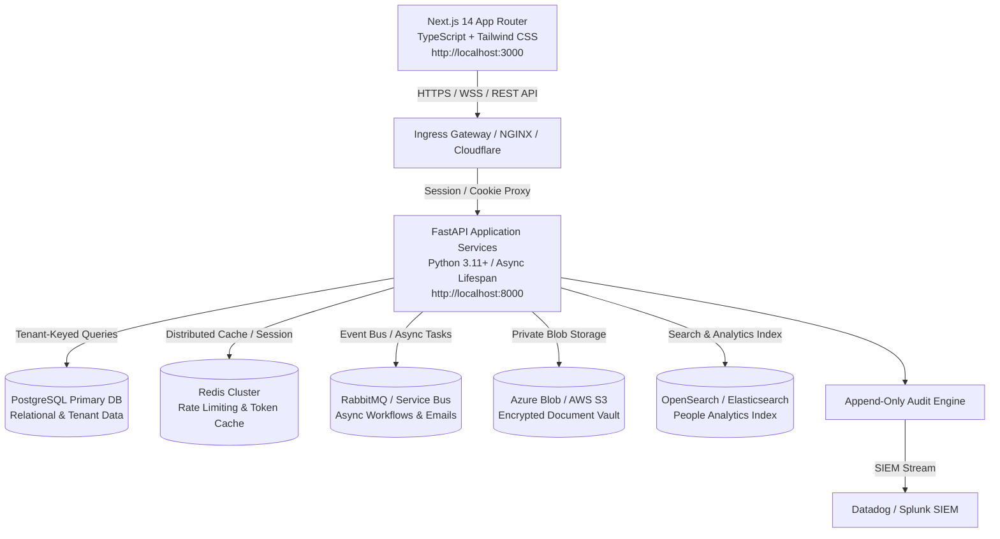
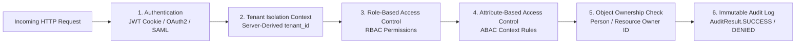
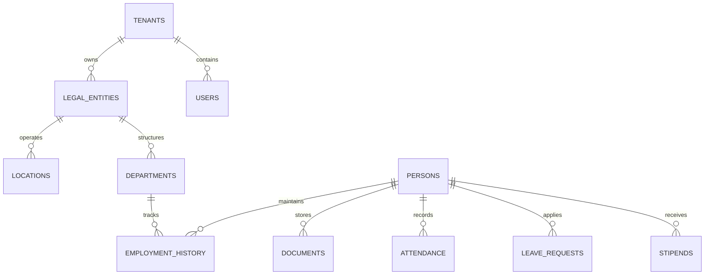
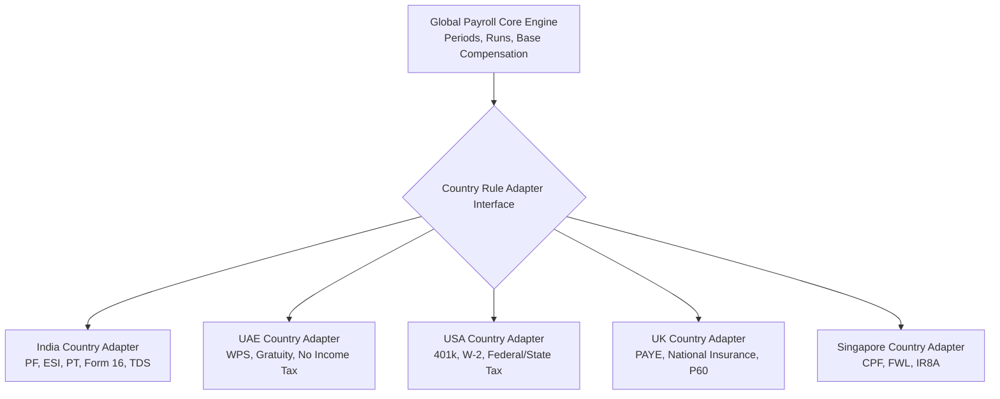
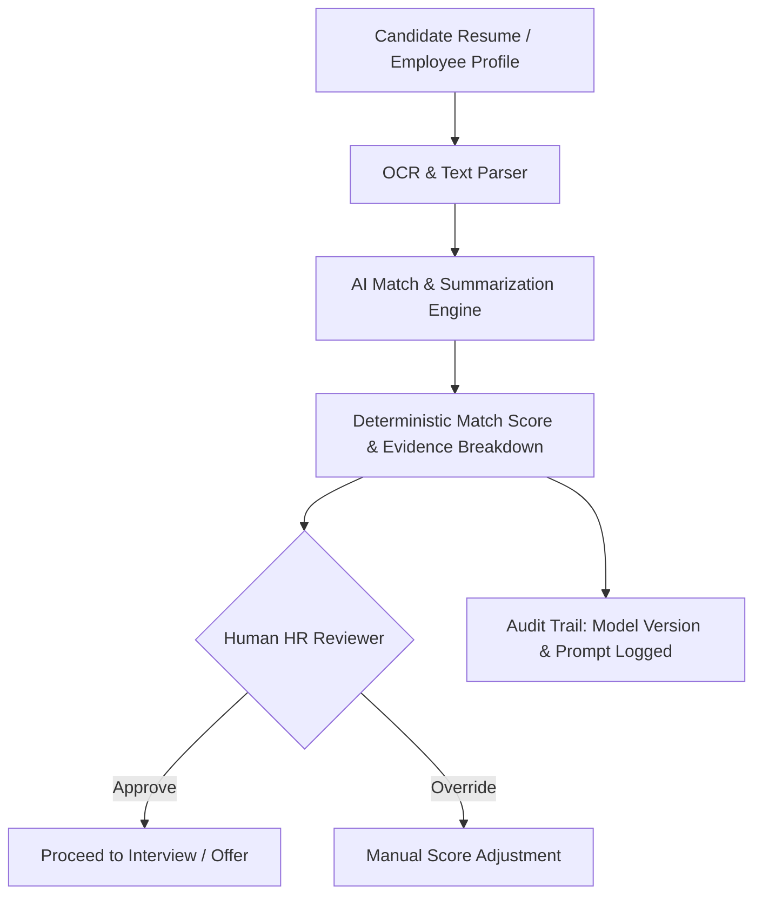
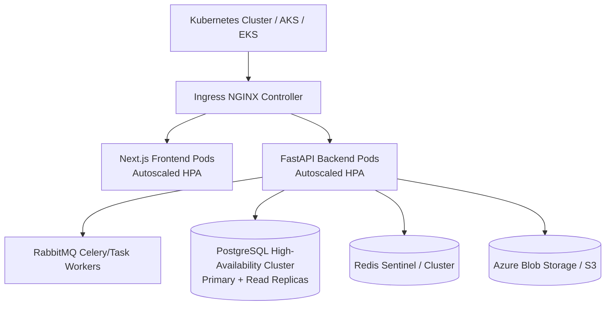

# Zeramai HRMS — Master System Architecture Document (v3.0 Baseline)

**Document Version:** 3.0.0  
**Target Platform:** Zeramai HRMS Enterprise Multi-Tenant Platform  
**Authors:** Enterprise Software Architecture Team  
**Status:** Baseline Production Architecture Specification  

---

## 1. High-Level System Architecture & Topology

Zeramai HRMS is architected as an **international-standard, multi-tenant SaaS platform**. It utilizes a decoupled presentation and business API model with enterprise-grade isolation, automated workflow orchestration, and governed AI intelligence.



---

## 2. 5-Layer Security & Authorization Architecture

Security is enforced at platform boundaries before any business logic executes. Every request passes through 5 distinct evaluation checkpoints:



### Security Layer Definitions

1. **Layer 1 — Authentication**: Decodes JWT `access_token` from HTTP-only, `SameSite=Lax` cookie. Supports SAML 2.0 / Okta / Entra ID SSO.
2. **Layer 2 — Tenant Isolation Context**: Resolves tenant identity from authenticated session (`current_user.tenant_id`). Client-supplied `tenant_id` query parameters are strictly forbidden from overriding server context.
3. **Layer 3 — Role-Based Access Control (RBAC)**: Checks assigned permission codes (`has_permission(user, code, db)`) via `Role` → `RolePermission` → `Permission` join.
4. **Layer 4 — Attribute-Based Access Control (ABAC)**: Evaluates dynamic environmental attributes (e.g., location, IP range, business unit).
5. **Layer 5 — Object-Level Ownership**: Enforces `person_id == current_user.person_id` for self-service operations to prevent Insecure Direct Object Reference (IDOR) vulnerabilities.
6. **Layer 6 — Append-Only Audit Logging**: Automatically logs all success and denial events to an immutable `audit_logs` ledger.

---

## 3. Data Architecture & Tenant Isolation Strategy

### 3.1 Multi-Tenant Data Schema Design
The application uses a **Shared Database, Tenant-Keyed Schema** model. Every tenant-owned table contains an indexed `tenant_id` column linked to `tenants.id`.



### 3.2 Effective-Dated HR Master Data
To preserve historical accuracy across promotions, transfers, compensation revisions, and manager reassignments, the core HR module enforces **Effective-Dated Records**:

```
EmploymentHistory
├── tenant_id (FK)
├── person_id (FK)
├── effective_date (DATE)
├── change_type (JOINING | PROMOTION | TRANSFER | COMPENSATION_REVISION)
├── designation (VARCHAR)
├── department_id (FK)
├── manager_id (FK)
└── salary_amount (NUMERIC)
```

---

## 4. Modular Global Payroll Adapter Architecture

To support multi-country payroll compliance without rewriting core business domain logic, payroll is structured into a **Global Core + Country Rule Adapters**:



---

## 5. Governed AI HR Intelligence Architecture

Artificial Intelligence capabilities in Zeramai HRMS operate under a **Human-in-the-Loop Governance Framework**:



- **No Autonomous Employment Decisions**: AI generates match scores, skill extractions, and policy summaries with clear evidence rationale.
- **Traceability**: All prompt inputs, model versions, and outputs are audit-logged for bias monitoring.

---

## 6. DevOps, Infrastructure & Kubernetes Deployment Strategy

zeramai HRMS scales horizontally from single-node Docker containers to multi-region Kubernetes clusters.



---

## 7. API Versioning & Integration Standards

- **RESTful Endpoints**: Versioned path structure `/api/v3/...`
- **Identity Provisioning**: SCIM 2.0 RFC 7644 endpoints (`/api/scim/v2/Users`)
- **Documentation**: Automatic OpenAPI 3.0 Swagger UI (`/docs`) & JSON schema (`/openapi.json`)
- **Webhooks**: Signed HMAC-SHA256 event notifications for downstream enterprise integrations.
