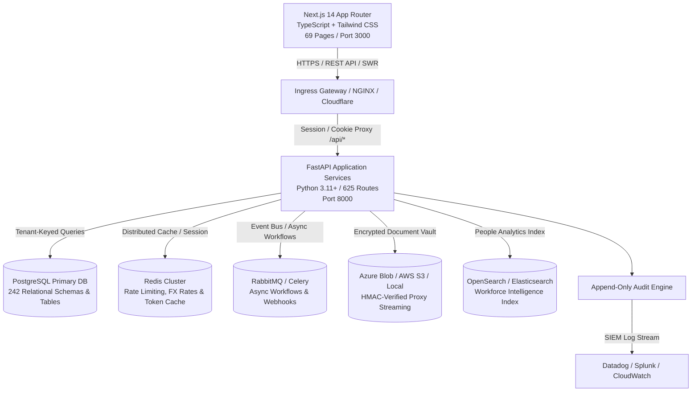
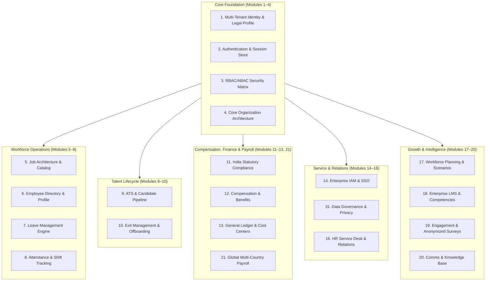
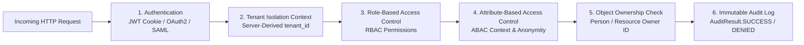
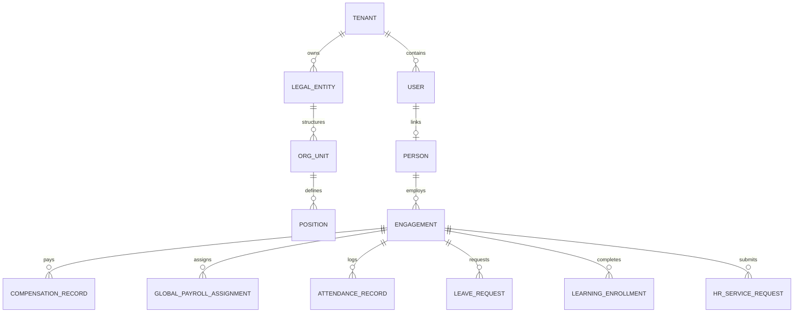
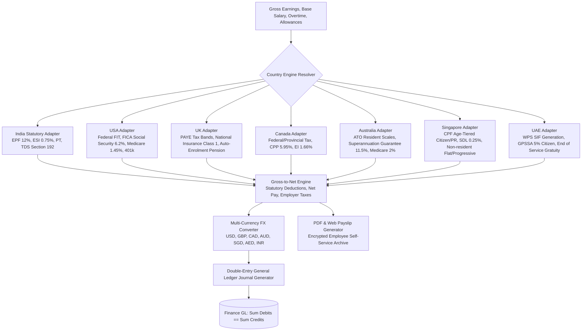
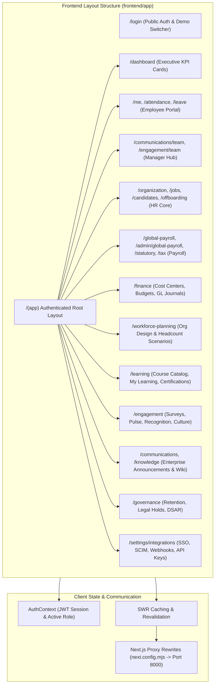
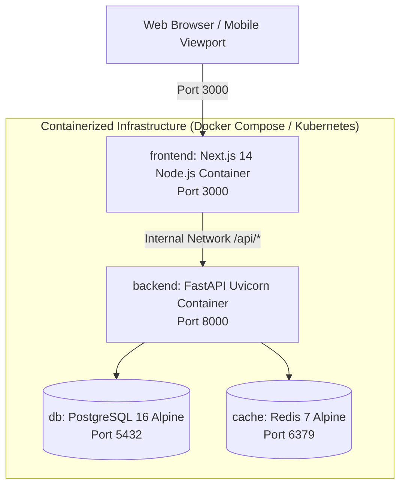

# Zeramai Enterprise HRMS — Master System Architecture Document (v2.1 Production Baseline)

**Document Version:** 2.1.0  
**Target Platform:** Zeramai Enterprise Multi-Tenant HRMS Platform  
**Architecture Scope:** Complete Modules 1–21 Integration  
**Alembic Head:** `a31824c94d6e`  
**Database Schema:** 242 Relational Tables (PostgreSQL / SQLite)  
**API Surface:** 625 OpenAPI Endpoints (`/api/v3/...`)  
**Frontend Compilation:** Next.js 14.2.35 App Router (69 Verified Pages)  
**Status:** Certified Production Architecture Specification  

---

## 1. High-Level System Architecture & Topology

Zeramai HRMS is architected as an **international-standard, multi-tenant SaaS platform** designed for enterprise human capital management, statutory compliance, workforce planning, and multi-country payroll. It adopts a decoupled presentation and business API topology with enterprise-grade tenant isolation, granular RBAC/ABAC authorization, automated workflow orchestration, and immutable audit logging.

---

## 2. Platform Core Architecture & The 21 Modules

The platform is structured into twenty-one specialized, loosely-coupled modules sharing a unified tenant and identity foundation:

### Module Breakdown Matrix

| Module | Functional Domain | Primary Entities & Models | API Routes Prefix |
| :--- | :--- | :--- | :--- |
| **M1** | Identity & Hierarchy | `Tenant`, `LegalEntity`, `Person`, `User` | `/api/v3/company-profile`, `/api/organizations` |
| **M2** | Auth & Session | `User`, `AuditLog`, `Session` | `/api/auth/login`, `/api/auth/me` |
| **M3** | RBAC / ABAC | `Role`, `Permission`, `RolePermission` | `/api/security-admin`, `/api/auth` |
| **M4** | Org Structure | `Department`, `Location`, `Position` | `/api/organizations`, `/api/departments` |
| **M5** | Job Architecture | `JobBand`, `JobGrade`, `JobProfile` | `/api/jobs`, `/api/v3/job-architecture` |
| **M6** | Employee Directory | `Engagement`, `PersonDocument`, `History` | `/api/employees`, `/api/me`, `/api/history` |
| **M7** | Leave Engine | `LeavePolicy`, `LeaveBalance`, `LeaveRequest`| `/api/leave`, `/api/v3/leave/policies` |
| **M8** | Attendance & Shifts | `AttendanceRecord`, `Shift`, `ShiftRoster`| `/api/attendance`, `/api/shifts` |
| **M9** | Recruitment / ATS | `Candidate`, `Interview`, `Offer` | `/api/candidates`, `/api/interviews`, `/api/offers` |
| **M10** | Exit & Offboarding | `Resignation`, `ExitClearance`, `Settlement` | `/api/v3/offboarding`, `/api/offboarding-admin` |
| **M11** | India Statutory | `EPFScheme`, `ESIScheme`, `PTRule`, `TDSFiling` | `/api/v3/statutory`, `/api/v3/tax` |
| **M12** | Comp & Benefits | `SalaryStructure`, `CompRevision`, `BenefitPlan`| `/api/v3/compensation`, `/api/v3/benefits` |
| **M13** | Finance & GL | `CostCenter`, `Budget`, `PayrollJournal` | `/api/v3/finance` |
| **M14** | IAM, SSO & SCIM | `IdPConfig`, `DirectoryConnection`, `Webhook` | `/api/v3/integrations`, `/api/scim/v2` |
| **M15** | Governance & DSAR | `DataClassification`, `RetentionPolicy`, `LegalHold` | `/api/v3/governance` |
| **M16** | HR Service Desk | `HRServiceRequest`, `InternalNote`, `Grievance` | `/api/v3/hr-requests`, `/api/v3/employee-relations` |
| **M17** | Workforce Planning | `OrgUnit`, `Position`, `Scenario`, `Headcount`| `/api/v3/workforce-planning` |
| **M18** | LMS & Career | `Course`, `Enrollment`, `Assessment`, `Skill` | `/api/v3/learning` |
| **M19** | Engagement & Culture | `SurveyTemplate`, `Campaign`, `Recognition` | `/api/v3/engagement` |
| **M20** | Comms & Knowledge | `Announcement`, `KnowledgeArticle`, `Category`| `/api/v3/communications`, `/api/v3/knowledge` |
| **M21** | Global Payroll | `CountryConfig`, `FXRate`, `PayGroup`, `Calendar` | `/api/v3/global-payroll` |

---

## 3. 5-Layer Security & Multi-Tenant Defense Architecture

Security is enforced at platform boundaries before business logic executes. Every request passes through 5 distinct evaluation checkpoints:

### Security Layer Definitions

1. **Layer 1 — Authentication**: Decodes JWT `access_token` from HTTP-only, `SameSite=Lax` cookie. Supports SAML 2.0 / Okta / Entra ID SSO.
2. **Layer 2 — Tenant Isolation Context**: Resolves tenant identity from authenticated session (`current_user.tenant_id`). Client-supplied `tenant_id` query parameters are strictly forbidden from overriding server context.
3. **Layer 3 — Role-Based Access Control (RBAC)**: Checks assigned permission codes (`has_permission(user, code, db)`) via `Role` → `RolePermission` → `Permission` join across standard enterprise roles (`SUPER_ADMIN`, `HR_ADMIN`, `HIRING_MANAGER`, `FINANCE`, `EMPLOYEE`).
4. **Layer 4 — Attribute-Based Access Control (ABAC)**: Evaluates dynamic attributes (department, office location, supervisory hierarchy) and enforces survey anonymity thresholds ($n \ge 5$ respondents).
5. **Layer 5 — Object-Level Ownership (IDOR Defense)**: Enforces `person_id == current_user.person_id` for self-service operations (payslips, tax declarations, performance records) to prevent Insecure Direct Object Reference vulnerabilities.
6. **Layer 6 — Immutable Audit Logging**: Automatically records all operations (Actor, IP, Entity, Action, Changeset, Result: `SUCCESS`, `DENIED`, `FAILURE`) into the append-only `audit_logs` table.

---

## 4. Multi-Tenant Data Architecture & Relational Model

The system enforces a **Shared Database, Tenant-Keyed Isolation Schema** model across all 242 relational tables:

### Core Hierarchy Design
- **`Tenant`**: Root SaaS account partition (e.g., *Zeramai Enterprise*).
- **`LegalEntity`**: Statutory corporate entity registered in a specific jurisdiction (country code, tax ID, registration number, base currency).
- **`Person`**: Unified human master identity preserving lifelong personal records across multiple roles, re-hires, or subsidiary transfers.
- **`User`**: System authentication principal (credentials, MFA, linked `person_id`, assigned roles).
- **`Engagement`**: Effective-dated employment contract (designation, department, manager, employment status, compensation tier).

---

## 5. Global Multi-Country Payroll & Compliance Architecture

The Global Payroll Engine (Module 21) operates as an extensible calculation pipeline supporting **7 Tier-1 countries**:

---

## 6. Frontend Architecture & Next.js 14 App Router

The user interface is built on **Next.js 14 App Router** with TypeScript and Tailwind CSS, featuring **69 fully static/prerendered pages**:

---

## 7. Infrastructure, Containerization & CI/CD Deployment

### Production Deployment Standards
- **Stateless Application Tier**: Backend pods scale horizontally behind a load balancer; session state is managed via signed JWTs and Redis token blacklist.
- **Database Migrations**: Managed via Alembic (`alembic upgrade head`) before traffic shift.
- **Zero-Trust Network**: Database and cache instances are unreachable from public networks; ingress routes exclusively through reverse proxies with TLS 1.3 encryption.
