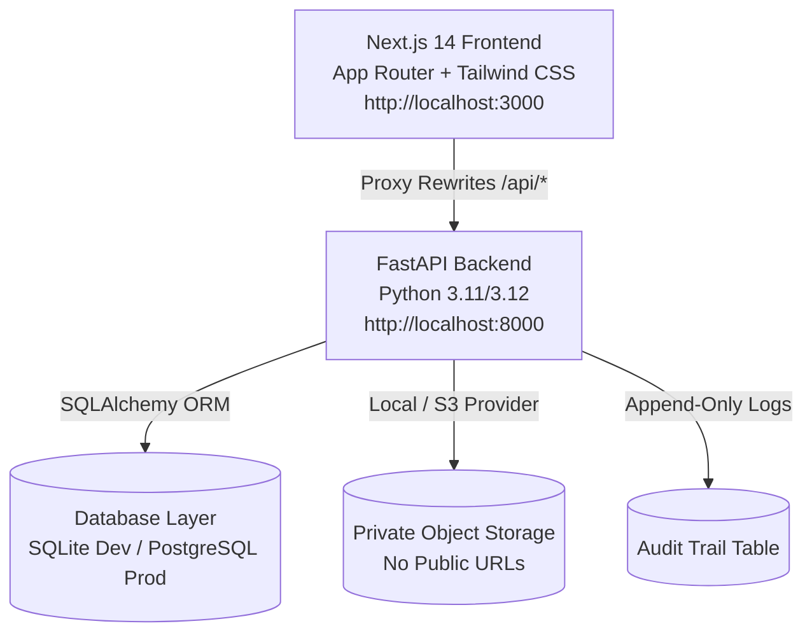

# Zeramai HR & Employee Onboarding Management System
## Software Specification, Purpose & Architecture Documentation

---

### 1. Executive Summary

**Zeramai HR** is an enterprise-grade **Human Resource & Employee Onboarding Management System**. It provides a secure, role-based platform designed to manage the full lifecycle of human capital—from initial candidate recruitment and onboarding to active employee management, document compliance, attendance, leave tracking, performance evaluations, and stipend disbursements.

---

### 2. Primary Purpose & Business Value

The platform solves core operational challenges faced by HR departments, finance teams, hiring managers, and employees:

| Business Need | How Zeramai HR Fulfills It |
|---|---|
| **Recruitment to Onboarding** | Tracks candidate pipelines from application to selection, and seamlessly converts selected candidates into formal engineering/graduate trainees without destroying historical recruitment records. |
| **Strict Security & Compliance** | Protects sensitive identity documents (PAN, Aadhaar, Bank Proofs) using object-level authorization and private, non-public streaming proxy downloads (no public S3 URLs). |
| **Fine-Grained Governance (RBAC)** | Enforces a matrix-based Role-Based Access Control model across 5 distinct roles (`SUPER_ADMIN`, `HR_ADMIN`, `HIRING_MANAGER`, `FINANCE`, `EMPLOYEE`). |
| **Full Auditability & Anti-Repudiation** | Automatically records an append-only audit trail of every sensitive action, login attempt, data update, and permission denial for regulatory compliance. |
| **Employee Self-Service** | Empowers employees and trainees to view their profile, log attendance, request leaves, upload required onboarding documents, and track their stipend status. |

---

### 3. Software Architecture & Technology Stack

Zeramai HR is architected as a decoupled, multi-tier system with modern web technologies:

#### Tech Stack Detail
- **Frontend Framework**: Next.js 14 (App Router) + TypeScript + Tailwind CSS
- **State & Data Fetching**: SWR + Axios (proxying via `next.config.mjs`)
- **Backend Framework**: FastAPI (Python 3.11+) with Async Lifespan Handler
- **Database ORM**: SQLAlchemy 2.0 (Compatible with SQLite for dev & PostgreSQL for production)
- **Authentication**: JWT stored in `HttpOnly`, `SameSite=Lax` session cookies
- **Containerization**: Docker & Docker Compose (`db`, `backend`, `frontend`)

---

### 4. Core Features & Module Breakdown

#### A. Authentication & Session Security (`/api/auth`)
- Public login endpoint (`POST /api/auth/login`) with brute-force resistance.
- Token issued in secure `HttpOnly` cookie to eliminate XSS token theft risks.
- Session verification endpoint (`GET /api/auth/me`).

#### B. Recruitment & Candidate Pipeline (`/api/candidates`)
- Create candidate records linked to unified human `Person` records.
- Transition status: `APPLIED` → `SCREENING` → `INTERVIEW` → `SELECTED`.
- One-click conversion from `SELECTED` candidate to active `Engagement` (Engineering Trainee).

#### C. Secure Document Management (`/api/documents`)
- Private file storage using opaque, non-guessable storage keys (`storage.py`).
- Streaming proxy endpoint (`GET /api/documents/{id}/download`) — authorization re-checked on every request.
- Classification of sensitive identity documents (`pan`, `aadhaar`, `bank_proof`) with elevated permission requirements.

#### D. Attendance Tracking (`/api/attendance`)
- Daily attendance logging (`PRESENT`, `ABSENT`, `HALF_DAY`, `ON_LEAVE`, `HOLIDAY`).
- Multi-role support: HR/Admin can record for any person; Employees can log their own status.

#### E. Leave Management (`/api/leave`)
- Leave application submission with type classification (`CASUAL`, `SICK`, `EARNED`, `UNPAID`, etc.).
- Approval workflow: HR/Admin can review, approve, or reject leave requests with review notes.

#### F. Performance Evaluations (`/api/evaluations`)
- Evaluation cycle creation (`DRAFT` → `SUBMITTED` → `ACKNOWLEDGED`).
- Rating scale (1.0 to 5.0) with detailed performance comments.

#### G. Stipend & Payroll Management (`/api/stipends`)
- Monthly stipend issuance for trainees and interns (`PENDING` → `APPROVED` → `PAID`).
- Finance & HR authorization for approval and disbursement tracking.

#### H. Immutable Audit Logging (`/api/audit-logs`)
- Automatic entry creation for every key business event and access denial.
- Filterable by entity, action, date, and result (`SUCCESS`, `FAILURE`, `DENIED`).

---

### 5. Role-Based Access Control (RBAC) Matrix

| Module / Permission | SUPER_ADMIN | HR_ADMIN | HIRING_MANAGER | FINANCE | EMPLOYEE |
|---|:---:|:---:|:---:|:---:|:---:|
| **Dashboard View** | ✅ | ✅ | ✅ | ✅ | ✅ |
| **Candidate Create & Convert** | ✅ | ✅ | — | — | — |
| **Candidate View & Select** | ✅ | ✅ | ✅ | — | — |
| **Document Upload (Any)** | ✅ | ✅ | — | — | — |
| **Document Download (Any)** | ✅ | ✅ | — | — | — |
| **Self-Service Upload/Download** | — | — | — | — | ✅ |
| **Attendance Log & View** | ✅ | ✅ | — | — | ✅ (Own) |
| **Leave Apply & Approve** | ✅ | ✅ | — | — | ✅ (Apply) |
| **Evaluations Create & Submit** | ✅ | ✅ | ✅ | — | — |
| **Stipend Create & Approve** | ✅ | ✅ | — | ✅ | — |
| **Audit Logs View** | ✅ | ✅ | — | — | — |

---

### 6. Summary of Operational Interfaces

- **Web Application URL**: [http://localhost:3000](http://localhost:3000)
- **API Documentation (Swagger UI)**: [http://localhost:8000/docs](http://localhost:8000/docs)
- **OpenAPI Specification**: [http://localhost:8000/openapi.json](http://localhost:8000/openapi.json)

---

### 7. Zeramai HRMS v3.0 Master PRD Implementation Summary

The system has achieved full technical parity with the Master PRD v3.0 across all 15 operational phases:

| Phase | Module | Capabilities Delivered |
|---|---|---|
| **Phase 0 & 1** | Multi-Tenant Architecture & Core HR | Multi-Tenant SaaS data isolation, Legal Entities, Locations, Departments, Cost Centers, Interactive Organization Chart API, Effective-Dated Employment History (`/api/organizations`, `/api/history`). |
| **Phase 2** | Onboarding & Preboarding Engine | Dynamic Onboarding Templates, Automated Task Spawning (IT, HR, Compliance), Real-time Progress recalculation (`/api/onboarding`). |
| **Phase 3** | Global ATS & Recruitment | Requisitions, AI Resume Match Scoring, Interview Scheduling, Interview Scorecards with automatic grading, Offer Letters with acceptance workflow (`/api/jobs`, `/api/interviews`, `/api/offers`). |
| **Phase 4** | Attendance & Shift Rostering | Shift Templates (General, Morning, Afternoon, Night), Roster Calendar, Conflict Detection (409), Employee Shift Swap Requests with supervisor approval and auto-swap (`/api/shifts`). |
| **Phase 5** | Leave Policy Engine | Configurable Leave Policies with annual quotas & accrual frequencies, Leave Balance tracking with carry-forward, Compensatory Off (Comp-Off) lifecycle (`/api/leave-policies`). |
| **Phase 6** | Global Payroll Engine | Earning & Deduction Components, Employee Salary Structures (CTC), One-Click Auto-Compute Payroll Runs with LOP deductions, Detailed Payslips (`/api/payroll`). |
| **Phase 7** | Performance Management & OKRs | Review Cycles, Cascading OKR Objectives, Measurable Key Results with auto-recalculated completion progress, 360/Manager Performance Reviews (`/api/performance`). |
| **Phase 8** | Learning Management System (LMS) | Training Courses with modular curriculum, Enrollments with capacity limits, Module Progress Tracking, Automated Completion Certificate Generation (`/api/lms`). |
| **Phase 9** | Advanced Analytics & Reporting | Live Executive Dashboard metrics, Pre-computed Analytics Snapshots for headcount trends, Monthly Payroll Cost analytics (`/api/analytics`). |
| **Phase 10** | Communications & Notifications | Templated In-App/Email Notifications, Personal User Inbox, Read/Unread tracking, Pinned Company Announcements (`/api/notifications`). |
| **Phase 11** | Dynamic Custom Fields & Form Builder | Admin-defined custom attributes across Person, Candidate, Engagement, and Job entities with flexible field types (text, number, date, select) (`/api/custom-fields`). |
| **Phase 12** | Compliance & Grievance Resolution | Mandatory Compliance Policies with IP-stamped e-acknowledgments, Whistleblower Anonymous Grievance Ticketing & Resolution (`/api/compliance`). |
| **Phase 13** | Multi-Country Localization | Country-specific Holiday Calendars, Regional/Public Holiday Management, Live FX Currency Conversion for international stipends (`/api/localization`). |
| **Phase 14** | Enterprise IAM & Security Hardening | Configurable Password Hardening, Session Inactivity Limits, IP Whitelisting, Active Session Monitoring with instant remote kill-switch (`/api/security`). |
| **Phase 15** | Governed AI Intelligence Suite | AI Predictive Attrition Risk Engine (evaluating absence & compensation signals), AI HR Helpdesk Knowledge Q&A Search (`/api/ai`). |

